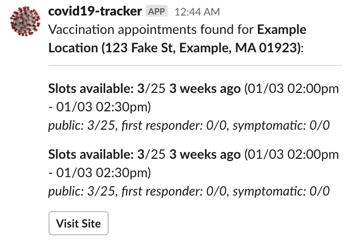

# COVID-19 Vaccine Tracker



This is a basic Python project which allows for curation of vaccine sign-up _backends_, as well as _notifiers_, and runs a rudimentary check of each backend at a specified interval and, if there are doses available, alerts via the configured notifiers.

Please be a good citizen by ensuring those who need the vaccine are able to get it first.

Currently, the following services are supported:
* Curative (curative.com/sites/<location_id>)
* RxTouch (<location_id>.rxtouch.com/covid19/Patient/Advisory)
* CVS Pharmacy (cvs.com/vaccine/intake/store/cvd-schedule) _**Note:** after a few attempts, CVS currently detects this script as a bot and blocks further requests. [See info in issue thread](https://github.com/jwoglom/covid19-vaccine-tracker/issues/1)_ 
* MAImmunizations (maimmunizations.org)

The following notifiers are supported:
* Console (to stdout, for debugging)
* CSV log (appends all available appointments to a csv file for later review)
* Slack (via webhook -- specify API token, slack channel, and bot username in config.py)

Currently a work-in-progress.

## Setup

The most important part of the setup process is creating your own config file.
Take a look at `config.py.example`, modify it to your needs, and create a file named `config.py` with your changes.

### Initial Setup

After creating your config file, initialize Pipenv and then run the script:

```
pipenv install
pipenv run python3 main.py
```

The application will, by default, check every 5 minutes for availabilities in the specified backends.
If an availability is found, it will use the provided backends to inform you.

For verbose logging, add `-v`.

To adjust the check interval, specify `-i <seconds>`.

See `--help` for more options.

### Daemon

Vaccine tracker runs by default in daemon mode, in which the script runs continuously and checks for updated availabilities on a predetermined interval.
You can use a system such as supervisord to run it in the background continuously.

Example supervisord configuration, which can be placed in `/etc/supervisor/conf.d/covid19.conf`:

```
[program:covid19]
command=bash -c 'cd /path/to/covid19-vaccine-tracker; pipenv run python3 main.py'
directory=/path/to/covid19-vaccine-tracker/
stderr_logfile=/path/to/covid19-vaccine-tracker/stderr.log
stdout_logfile=/path/to/covid19-vaccine-tracker/stdout.log
user=yourusername
numprocs=1
autostart=true
autorestart=true
```

### Cron

You can alternatively use your own mechanism for controlling when to check for new availabilities with the `--stop-after=1` (`-a 1`) option.

When specified, the script will check once and then exit. You can customize the `--stop-after` numeric value along with the `--interval` to be higher if desired.

### GitHub Actions

A GitHub Actions workflow is provided at `.github/workflows/runtracker.yml` inside the repository.

To use it, fork the repo.
Then clone it locally and perform the steps above so that you can tweak your config file.

Go to 'Settings > Secrets' in the GitHub repository settings and create a secret titled `CONFIG_PY`.

For its value, copy and paste the contents of your `config.py` file.

Go to the Actions tab, select 'RunTracker', and click the 'Run workflow' button to initially trigger the action.
Check the log output to ensure it is working properly.

As configured, the action will run every 5 minutes indefinitely until the GitHub workflow is disabled.
However, [GitHub does not guarantee that actions will run at this interval](https://upptime.js.org/blog/2021/01/22/github-actions-schedule-not-working/).
You may wish to incorporate some out-of-bound checking to ensure GitHub is still running the tracker at an okay interval, so you don't discover later on that it randomly stopped working.

## License

This code may be used, modified, or adapted for any non-commercial purpose related to helping individuals become vaccinated against COVID-19, as long as attribution is provided to the original project.